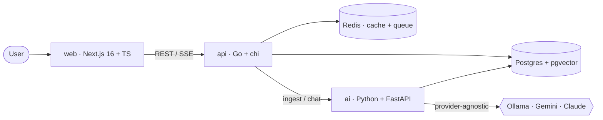

# ragdesk

[](https://github.com/thefcan/ragdesk/actions/workflows/ci.yml)
[](LICENSE)
[](api/go.mod)
[](ai/)
[](web/)

> **A multi-tenant, AI-powered knowledge SaaS.** Teams upload their documents
> and chat with an assistant that answers **only from those documents, with
> citations** — Retrieval-Augmented Generation (RAG) as a real, billable product.

ragdesk is built the way production AI software actually ships: a strongly-typed
**Go** core for tenancy, billing and metering; a **Python/FastAPI** service for
the LLM and embedding pipeline; **Postgres + pgvector** for rows *and* vectors;
and a **provider-agnostic** model layer so it runs on a **free, local LLM
(Ollama)** in development and swaps to a hosted model in one line. The entire
stack runs on **$0** of paid infrastructure.

---

## ✨ Features

- 🏢 **Multi-tenant workspaces** — organizations, members, roles, hard data isolation
- 📄 **Document ingestion** — upload → extract → chunk → embed → `pgvector` (async)
- 💬 **RAG chat** — streaming answers grounded in your documents, **with citations**
- 🔌 **Provider-agnostic LLM** — Ollama (local/$0), Gemini/Groq (free tier), or Claude
- 💳 **Billing & metering** — Stripe subscriptions, usage limits, plan enforcement
- 🔒 **Production hardening** — JWT auth, rate limiting, structured logs, health probes
- 📊 **Observability** — OpenTelemetry traces, structured logging, readiness checks
- 🐳 **Cloud-native** — multi-stage Docker images, `docker compose up`, GitHub Actions CI

## 🖼️ Demo

> 🚧 The UI ships in Phase 1+. Real screenshots of the workspace dashboard,
> streaming chat with citations, and the billing portal will be embedded here as
> each surface lands.

| Workspace & documents | RAG chat with citations | Billing & usage |
|---|---|---|
| _coming in Phase 1–2_ | _coming in Phase 3_ | _coming in Phase 4_ |

## 🏗️ Architecture



See [`docs/architecture.md`](docs/architecture.md) for the full design and the
reasoning behind each choice.

## 🧰 Tech stack

| Layer | Choice |
|-------|--------|
| Frontend | Next.js 16, TypeScript, Tailwind |
| Core API | Go 1.26, chi, pgx, go-redis |
| AI service | Python, FastAPI, pgvector, Ollama |
| Data | PostgreSQL 16 + pgvector, Redis 7 |
| Billing | Stripe (test mode) |
| Infra | Docker (multi-stage, distroless), docker-compose, GitHub Actions |

## 🚀 Quickstart

```bash
git clone https://github.com/thefcan/ragdesk.git
cd ragdesk
cp .env.example .env

# Bring up Postgres (pgvector), Redis, the Go API and the Python AI service
make up        # == docker compose up --build -d

# Verify everything is healthy
curl -s localhost:8080/healthz   # api liveness
curl -s localhost:8080/readyz    # api + postgres + redis
curl -s localhost:8000/healthz   # ai liveness
```

For the local, $0 LLM:

```bash
# install Ollama (https://ollama.com), then pull small models that fit 16 GB
ollama pull llama3.2:3b          # generation
ollama pull nomic-embed-text     # embeddings
```

## 🗺️ Roadmap

Built phase by phase, each shipped with tests, clean commits, Docker and green CI.

- [x] **Phase 0 — Skeleton**: monorepo, docker-compose (Postgres+pgvector, Redis), Go & Python health services, CI
- [ ] **Phase 1 — Auth & multi-tenancy**: register/login (JWT), workspaces, members, roles, isolation
- [ ] **Phase 2 — Document ingestion**: upload → chunk → embed → `pgvector` (async queue)
- [ ] **Phase 3 — RAG chat**: retrieval + streaming answers + citations, provider-agnostic LLM
- [ ] **Phase 4 — Billing & metering**: Stripe subscriptions, usage limits, rate limiting
- [ ] **Phase 5 — Production polish**: OpenTelemetry, multi-stage images, free-tier deploy, screenshots

## 💸 Runs on $0

Every component has a free path: Ollama (local LLM), Postgres+pgvector and Redis
in Docker, Stripe **test mode**, Vercel + Supabase + Render free tiers, and
GitHub Actions for public repos. See the table in
[`docs/architecture.md`](docs/architecture.md).

## 📄 License

MIT © 2026 Furkan Can Karafil
