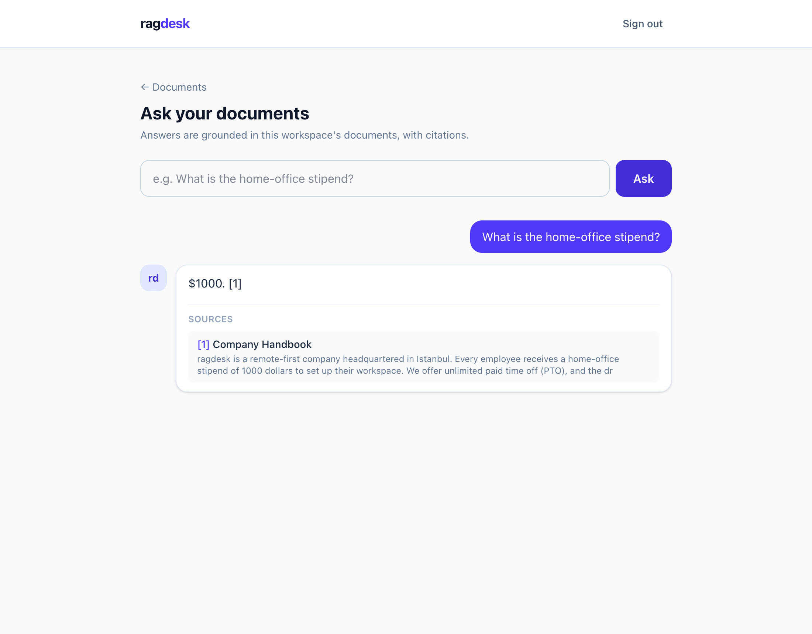
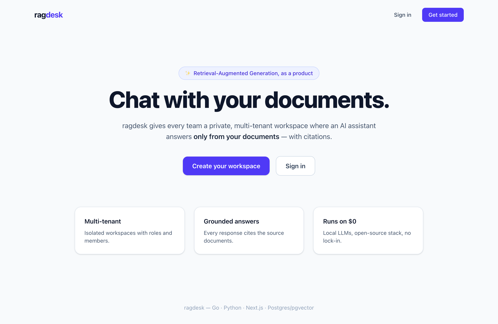
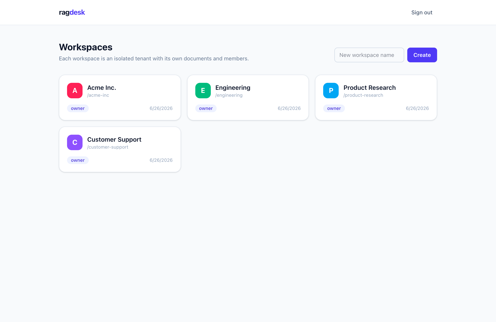
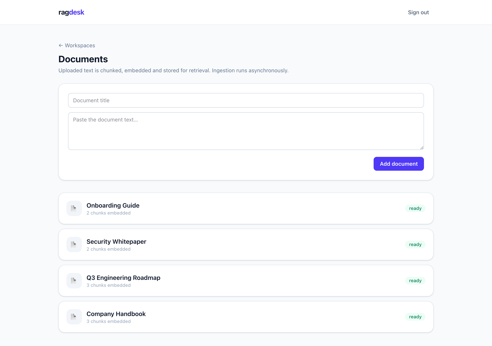
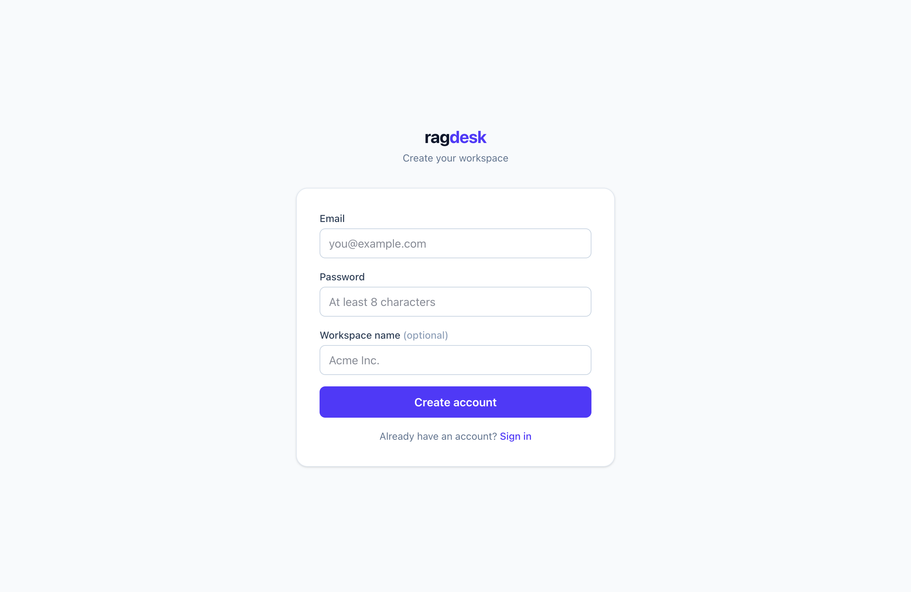

# ragdesk

[](https://github.com/thefcan/ragdesk/actions/workflows/ci.yml)
[](https://github.com/thefcan/ragdesk/actions/workflows/codeql.yml)
[](LICENSE)
[](api/go.mod)
[](ai/)
[](web/)

> **A multi-tenant, AI-powered knowledge SaaS.** Teams upload their documents
> and chat with an assistant that answers **only from those documents, with
> citations** — Retrieval-Augmented Generation (RAG) as a real, billable product.

ragdesk is built the way production AI software actually ships: a strongly-typed
**Go** core for tenancy, billing and metering; a **Python/FastAPI** service for
the LLM and embedding pipeline; a **Next.js** front-end; **Postgres + pgvector**
for rows *and* vectors; and a **provider-agnostic** model layer so it runs on a
**free, local LLM (Ollama)** in development. The entire stack runs on **$0** of
paid infrastructure.

---

## 🖼️ Demo

**Ask your documents — grounded answers, with citations:**

[](docs/screenshots/chat.png)

| Landing | Workspaces dashboard — multi-tenant |
|---|---|
| [](docs/screenshots/landing.png) | [](docs/screenshots/dashboard.png) |

| Documents — async ingestion → embeddings | Create account |
|---|---|
| [](docs/screenshots/documents.png) | [](docs/screenshots/register.png) |

## ✨ Features

- 🏢 **Multi-tenant workspaces** — organizations, members, roles, hard data isolation
- 🔐 **JWT auth** — register/login with bcrypt-hashed passwords, HS256 tokens
- 📄 **Document ingestion** — upload → chunk → embed (Ollama) → `pgvector`, processed async via a Redis queue + worker
- 💬 **RAG chat** — streaming answers grounded in your documents, **with citations** (pgvector cosine retrieval)
- 🔌 **Provider-agnostic LLM** — Ollama (local/$0), Gemini/Groq (free tier), or Claude
- 💳 **Billing & metering** *(Phase 4)* — Stripe subscriptions, usage limits, plan enforcement
- 🔒 **Production hardening** — rate limiting, structured logs, health probes, govulncheck, CodeQL
- 🐳 **Cloud-native** — multi-stage Docker images, `docker compose up`, GitHub Actions CI

## 🏗️ Architecture


See [`docs/architecture.md`](docs/architecture.md) for the full design.

## 🧰 Tech stack

| Layer | Choice |
|-------|--------|
| Frontend | Next.js 16, TypeScript, Tailwind v4 |
| Core API | Go 1.26, chi, pgx, go-redis, JWT, bcrypt |
| AI service | Python, FastAPI, pgvector, Ollama |
| Data | PostgreSQL 16 + pgvector, Redis 7 |
| Billing | Stripe (test mode) |
| Infra | Docker (multi-stage, distroless), docker-compose, GitHub Actions, CodeQL |

## 🚀 Quickstart

```bash
git clone https://github.com/thefcan/ragdesk.git
cd ragdesk
cp .env.example .env

# Backend: Postgres (pgvector), Redis, the Go API and the Python AI service
make up                                   # docker compose up --build -d

# Frontend (Next.js) — in another terminal
cd web && npm install && npm run dev      # http://localhost:3000
```

Try the API directly:

```bash
# register (bootstraps a default workspace) and call an authenticated endpoint
TOKEN=$(curl -s -X POST localhost:8080/auth/register \
  -H 'Content-Type: application/json' \
  -d '{"email":"you@example.com","password":"supersecret"}' | jq -r .token)

curl -s localhost:8080/workspaces -H "Authorization: Bearer $TOKEN"
```

## 🔌 API (today)

| Method | Path | Auth | Description |
|--------|------|------|-------------|
| POST | `/auth/register` | public | Create a user + default workspace, returns a JWT |
| POST | `/auth/login` | public | Exchange credentials for a JWT |
| GET | `/workspaces` | Bearer | List the caller's workspaces |
| POST | `/workspaces` | Bearer | Create a workspace |
| GET | `/workspaces/{id}` | Bearer | Get a workspace (members only) |
| GET | `/workspaces/{id}/members` | Bearer | List members |
| POST | `/workspaces/{id}/members` | Bearer | Add a member (owner/admin) |
| GET | `/workspaces/{id}/documents` | Bearer | List a workspace's documents |
| POST | `/workspaces/{id}/documents` | Bearer | Upload a document (async ingestion) |
| POST | `/workspaces/{id}/chat` | Bearer | Ask a question — streaming RAG answer with citations |
| GET | `/healthz` · `/readyz` · `/version` | public | Probes & build info |

## 🗺️ Roadmap

Built phase by phase, each shipped with tests, clean commits, Docker and green CI.

- [x] **Phase 0 — Skeleton**: monorepo, docker-compose (Postgres+pgvector, Redis), Go & Python health services, CI, CodeQL, Dependabot
- [x] **Phase 1 — Auth & multi-tenancy**: JWT register/login, workspaces, members, roles, tenant isolation, **Next.js web** (landing, auth, dashboard)
- [x] **Phase 2 — Document ingestion**: upload → chunk → embed (Ollama) → `pgvector`, async Redis queue + worker
- [x] **Phase 3 — RAG chat**: pgvector cosine retrieval + streaming answers + citations, provider-agnostic LLM
- [ ] **Phase 4 — Billing & metering**: Stripe subscriptions, usage limits, rate limiting
- [ ] **Phase 5 — Production polish**: OpenTelemetry, free-tier deploy

## 💸 Runs on $0

Every component has a free path: Ollama (local LLM), Postgres+pgvector and Redis
in Docker, Stripe **test mode**, Vercel + Supabase + Render free tiers, and
GitHub Actions for public repos.

## 📄 License

MIT © 2026 Furkan Can Karafil
