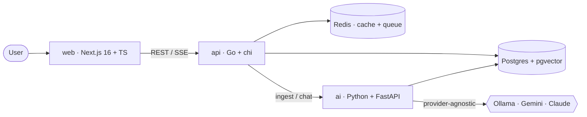

# Architecture

ragdesk is a multi-tenant, AI-powered knowledge SaaS. Teams create a
**workspace**, upload documents, and chat with an assistant that answers
**only from their documents**, with citations — a Retrieval-Augmented
Generation (RAG) product.

## Services

| Service | Stack | Responsibility |
|---------|-------|----------------|
| `web`   | Next.js 16, TypeScript, Tailwind | Auth UI, workspace dashboard, streaming chat, billing portal |
| `api`   | Go, chi, pgx, go-redis | Auth/JWT, multi-tenancy, documents, **Stripe billing**, usage metering, rate limiting |
| `ai`    | Python, FastAPI | Document ingestion (chunk → embed → pgvector), retrieval, RAG chat, **provider-agnostic LLM** |
| `postgres` | pgvector/pg16 | Relational data **and** vector embeddings in one store |
| `redis` | redis:7 | Cache, rate limiting, background job queue |

## Why this split

- **Go core, Python AI** mirrors how real AI products are built: a fast,
  strongly-typed service layer for tenancy/billing, and Python where the
  LLM/embedding ecosystem lives.
- **One Postgres for rows and vectors** (via `pgvector`) keeps the $0
  footprint small and avoids a separate vector database.
- **Provider-agnostic LLM** — the model is an implementation detail behind an
  interface. Local **Ollama** for $0 development, a free-tier hosted provider
  for cloud demos, and Claude when there is budget. This is the production
  pattern (model routing + fallback), not a single hard-coded vendor.

## $0 deployment target

| Concern | Free option |
|---------|-------------|
| Frontend | Vercel free tier |
| Postgres + auth + storage | Supabase free tier |
| Redis | Upstash free tier |
| Backend services | Render / Koyeb free tier |
| LLM | Ollama (local) / Gemini free tier |
| CI/CD | GitHub Actions (public repo) |
| Billing | Stripe test mode |
